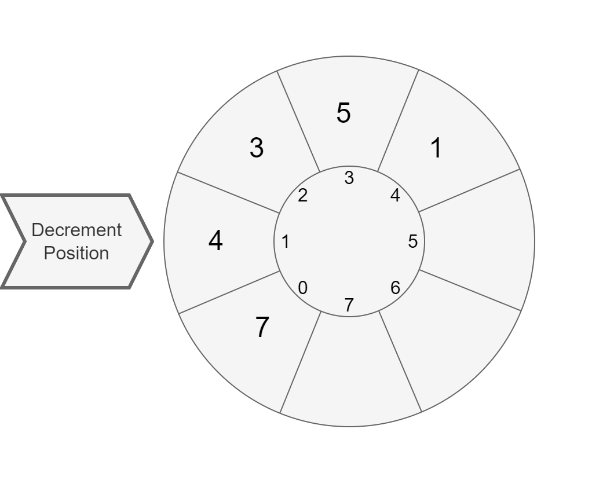

# Decrementing Carousel Plus

The purpose of this exercise is to train you designing simple classes and their relations.

Estimated workload of this exercise is _2h_.

### Description

[`Decrementing Carousel`](src/main/java/com/epam/rd/autotasks/DecrementingCarousel.java) is a container, accepting `int` elements.
`DecrementingCarousel` has a maximum capacity, specified via the constructor.
When created, `DecrementingCarousel` is in accumulating state: you may add elements via the `addElement` method and can produce a [`CarouselRun`](src/main/java/com/epam/rd/autotasks/CarouselRun.java) object via the `run` method.
Once the `run` method is called, `DecrementingCarousel` is in running state: it refuses adding more elements.

The `CarouselRun` allows to iterate over elements of the carousel decrementing them one by one with the `next` method.
The `next` returns the value of the current element:


Then it decreases the current element by one and switches to the next element:




The `CarouselRun` iterates over elements in the order of their insertion.  
When an element is decreased to zero, the `CarouselRun` will skip it in further iterations.
When there are no more elements available for decrementing, the `CarouselRun` returns `-1`.

The `CarouselRun` also has the `isFinished` method, which indicates, if the carousel has run out of the lements to decrement.

### Specification Details
`DecrementingCarousel` has two public methods:
- `final boolean addElement(int element)` - adds an element. 
  If element is negative or zero, do not add the element.
  If container is full, do not add the element.
  If the `run` method was called to create a `CarouselRun`, do not add the element.
  If element is added successfully, return `true`. Return `false` otherwise.
- `final CarouselRun run()` - returns a `CarouselRun` to iterate over the elements.
  If the `run` method has already been called earlier, it must return `null`:
  `DecrementingCarousel` may generate only one `CarouselRun` object.

`CarouselRun` has two public methods:
- `final int next()` - returns the current value of the current element, 
  then decreases the current element by one and switches to the next element in insertion order.
  Skips zero elements. When there is no more elements to decrease, returns `-1`.
- `final boolean isFinished()` - when there is no more elements to decrease, returns `true`. Otherwise, returns `false`.

### Restriction
You may not use collections or streams when implementing this task.

### Examples

Empty case:
```java
CarouselRun run = new DecrementingCarousel(7).run();
System.out.println(run.isFinished()); //true
System.out.println(run.next()); //-1
```

Regular case:
```java
DecrementingCarousel carousel = new DecrementingCarousel(7);

carousel.addElement(2);
carousel.addElement(3);
carousel.addElement(1);

CarouselRun run = carousel.run();

System.out.println(run.isFinished()); //false

System.out.println(run.next()); //2
System.out.println(run.next()); //3
System.out.println(run.next()); //1

System.out.println(run.next()); //1
System.out.println(run.next()); //2

System.out.println(run.next()); //1

System.out.println(run.isFinished()); //true
System.out.println(run.next()); //-1
```

Refusing adding more elements case:
```java
DecrementingCarousel carousel = new DecrementingCarousel(3);

System.out.println(carousel.addElement(-2)); //false
System.out.println(carousel.addElement(0)); //false
        
System.out.println(carousel.addElement(2)); //true
System.out.println(carousel.addElement(3)); //true
System.out.println(carousel.addElement(1)); //true

//carousel is full
System.out.println(carousel.addElement(2)); //false

CarouselRun run = carousel.run();

System.out.println(run.next()); //2
System.out.println(run.next()); //3
System.out.println(run.next()); //1

System.out.println(run.next()); //1
System.out.println(run.next()); //2

System.out.println(run.next()); //1

System.out.println(run.isFinished()); //true
System.out.println(run.next()); //-1
```

Refusing to add more elements after "run" was called:
```java
DecrementingCarousel carousel = new DecrementingCarousel(10);

System.out.println(carousel.addElement(2)); //true
System.out.println(carousel.addElement(3)); //true
System.out.println(carousel.addElement(1)); //true

carousel.run();

System.out.println(carousel.addElement(2)); //false
System.out.println(carousel.addElement(3)); //false
System.out.println(carousel.addElement(1)); //false
```

Refusing to create more than one CarouselRun:
```java
DecrementingCarousel carousel = new DecrementingCarousel(10);
System.out.println(carousel.run() == null); //false
System.out.println(carousel.run() == null); //true
```
