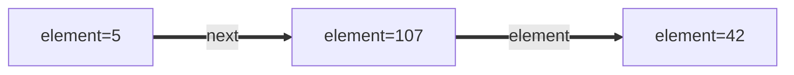
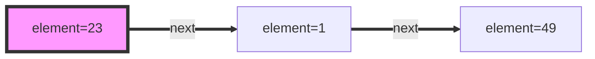
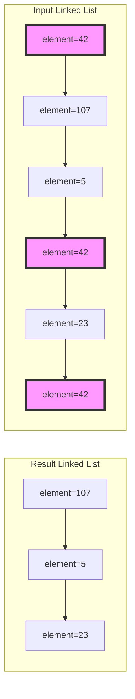
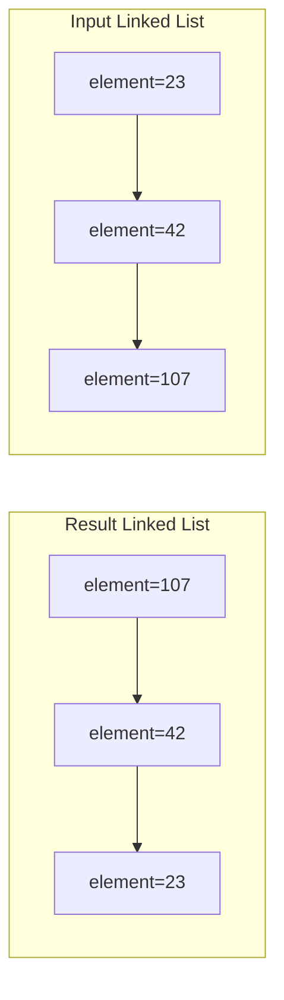
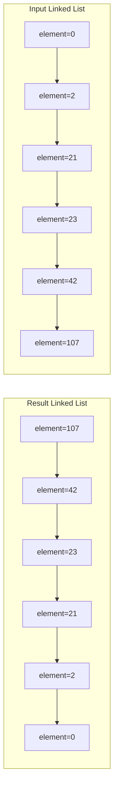
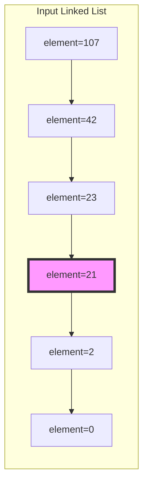
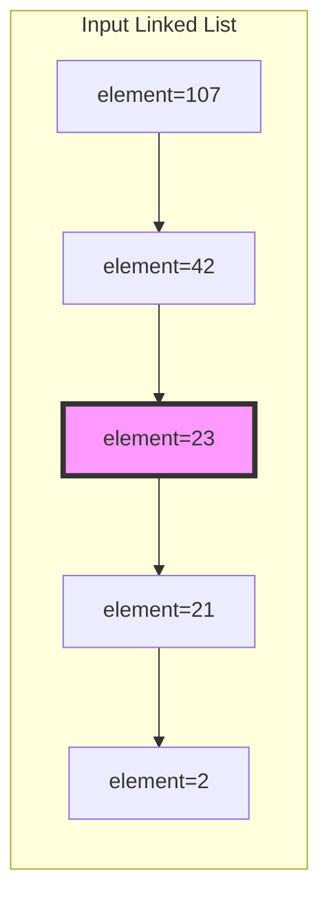

# Linked List

## Purpose

The following coding exercises are designed to test your knowledge of the following concepts:
* Basic data structure for elements of linked lists
* Operations with linked lists

## Overview

The coding exercises cover the following practical problems:
* Creating a linked list using given values
* Removing elements of a linked list by value
* Reversing a linked list
* Finding the middle element of a linked list

## Coding exercises

### Exercise 1: Create a linked list using a given list of values

#### Elements of linked lists

The following snippet contains the very basic data structure that could be used to represent a singly linked lists. Of course, the class can be expanded with additional information if necessary.

```java
import java.util.List;

/**
 * Basic data structure for custom linked list representation
 */
public class CustomLinkedList<E> {

    /**
     * Internal class for representing a linked list node
     */
    protected static class CustomListNode<E> {
        /**
         * Data part
         */
        protected E element;
        /**
         * Link to the next node
         */
        protected CustomListNode<E> next;

        public CustomListNode(E element, CustomListNode<E> next) {
            this.element = element;
            this.next = next;
        }
    }

    /**
     * Linked list head
     */
    protected CustomListNode<E> head;

    /**
     * Constructor from a list instance.
     * @param elements elements that should be inserted into the result linked list.
     */
    public CustomLinkedList(List<E> elements) {
        //put your here
        head = null;
    }

    /**
     * Returns a linked list after removal of all nodes, containing element.
     * @param element element for removal
     * @return a linked list after removal
     */
    public CustomLinkedList<E> removeNodes(E element) {
        //put your here
        return this;
    }

    /**
     * @return a linked list after reversing
     */
    public CustomLinkedList<E> reverse() {
        //put your here
        return this;
    }

    /**
     * Returns a given list with head that refers to the right half of a given linked list.
     * @return a linked list after reversing
     */
    public CustomLinkedList<E> getRightMiddle() {
        //put your here
        return this;
    }

    /**
     * Returns whether `this` instance is identical to `list` one, order of elements matters
     * @param elements `list` for identification
     * @return result of comparison
     */
    public boolean check(List<E> elements) {
        //put your here
        return false;
    }

}
```

Assume that, for all programming assignments in this set of coding exercises, the following data class
will be used to represent linked lists.

For example, the following linked list can be created using the snippet below:



```
a = new CustomListNode<>(42, null);
b = new CustomListNode<>(107, a);
c = new CustomListNode<>(5, b);
```

#### Problem statement

Given a list of values, return a linked list with the initial values.

**Example:**

Input: `List.of(23, 1, 49)`

Expected result:



### Exercise 2: Remove elements of linked list by value

Given a linked list and an `element`, remove all the nodes of the linked list 
with elements equaled to the `element`, and return *the new linked list*.

**Example 1:**



Here and in the examples below the element to remove is `42`. 

**Example 2:**

Input: `List.of(42, 42, 42)`

Expected result: an empty linked list.


**Example 3:**

Input: `List.of()`

Expected result: an empty linked list.


### Exercise 3: Reverse a given linked list

Given a linked list, reverse the list, and return the reversed list.


**Example 1:**



**Example 2:**



**Example 3:**

Input: `List.of()`

Expected result: an empty linked list.


### Exercise 4: Find the middle node of a given linked list

Given a linked list, return the linked list from *the middle node of the given one*.

If there are two middle nodes, return from **the second middle** node.

**Example 1:**



**Example 2:**



**Example 3:**

Input: `List.of()`

Expected result: an empty linked list.
