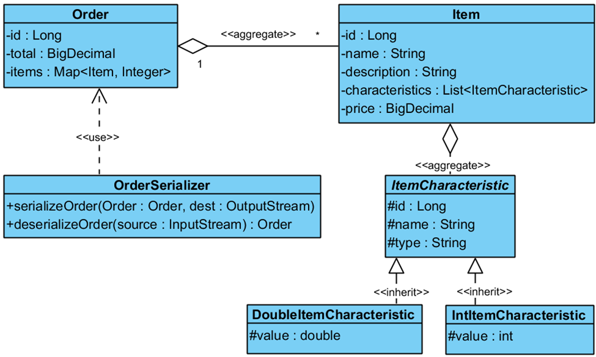

# Serialization

The purpose of this task is to familiarize you with the mechanism of complex object serialization/deserialization. 

It should take you about _1 hour_ to complete this task.  

## Description

In this exercise, you need to implement the serialization of complex objects of the `Order` type. Below is a hierarchy of classes that describe orders.

### Classes to be serialized

The `Order` class represents an order:

- `id` \
  A unique identifier of the order
- `total` \
  The cost of the order, which is automatically calculated and can only be read 
- `items` \
  A map that stores products (a key is an object of the `Item` type) and the number of units to be purchased (a value is a variable of the `int` type)

The `Item` class represents a product:

- `id` \
  A unique identifier of the product
- `name` \
  The name of the product
- `description` \
  A short description of the product
- `characteristics` \
  A list of product features (objects of the `ItemCharacteristic` type)

The abstract class `ItemCharacteristic` represents one characteristic of a product and is the supertype for different types of product characteristics:

- `id` \
  A unique identifier of the characteristic
- `name` \
  The name of the characteristic
- `type` \
  A data type of the characteristic (`String`, `Integer`, `Double`, etc.)

The `IntItemCharacteristic` class represents an integer characteristic and inherits the `ItemCharacteristic` class:

- `value` \
  Keeps the value of the characteristic 
 
The `DoubleItemCharacteristic` class represents a numeric characteristic and inherits the `ItemCharacteristic` class:

- `value` \
 Keeps the value of the characteristic

### The class that performs serialization or deserialization

The `OrderSerializer` class serializes and deserializes objects of the `Order` class:

- `public static void serializeOrder(Order order, OutputStream out) throws IOException` \
  Serializes a specified object of the Order class into the given data output stream
- `public static Order deserializeOrder(InputStream in) throws IOException, ClassNotFoundException` \
  Deserializes a specified object of the `Order` class from the given data input stream

## Details:

* Each entity class must contain a constructor that accepts values for all fields and can contain any other constructors if necessary.  
* All entity classes must have getters and setters for all fields. 
* All entity classes must contain an overridden `equals()` method for comparing all fields.
* The `ItemCharacteristic` class must be `abstract` and must not implement the `Serializable` interface.
* When calculating the cost of an order in the `Order` class, set the `total` field value using the following algorithm: 
    1.	If the `total` field is `null` and the `items` field is not `null`, a call of the `getTotal()` method must calculate the total value.  
    2.	If the `items` field is `null`, the `total` must be zero.  
    3.	The internal state of the `items` field is guaranteed not to change after being installed in the object.  

* The custom serialization mechanism must be implemented in all descendants of the `ItemCharacteristic` class because it is not serializable.

## Restrictions:

- You may not use the serialization mechanism with the `Externalizable` interface.
